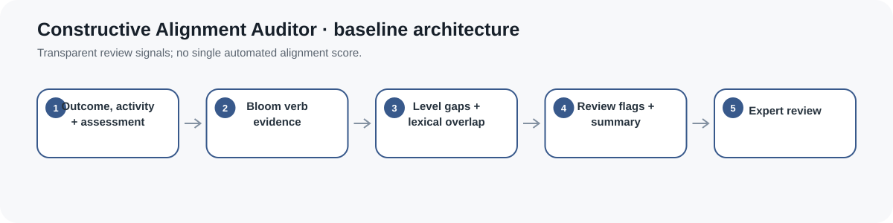
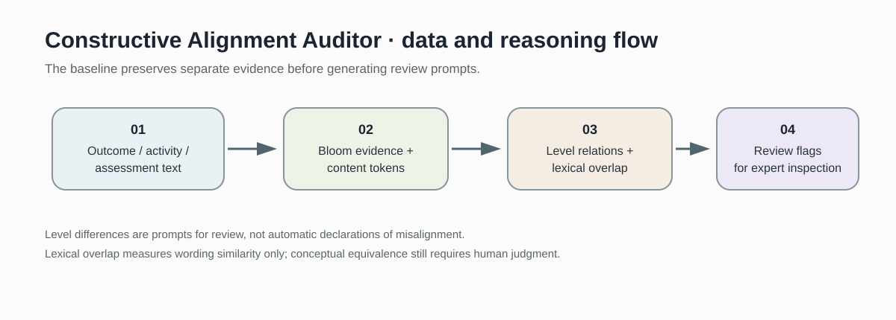
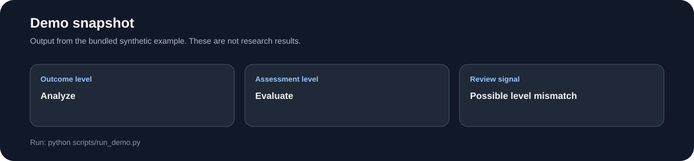
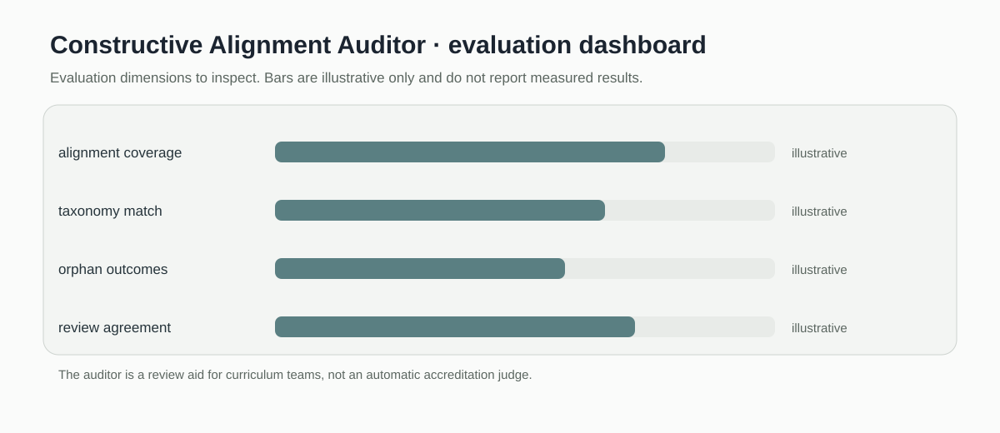

# Constructive Alignment Auditor

> Rule based baseline for checking cognitive level and lexical overlap across outcomes, activities, and assessments.

[](https://github.com/devissaputra/constructive-alignment-auditor/actions/workflows/ci.yml)



**Area:** Instructional Design & Curriculum Intelligence    
**Status:** working research prototype  
**Author:** Devis Wawan Saputra

## What this project is for

A course can have strong objectives, useful activities, and fair assessments yet still be poorly aligned. This tool compares the cognitive demand and language of those three pieces so a designer can spot mismatches early and review them with context.

**Who may find it useful:** Instructional designers, curriculum teams, and education researchers studying constructive alignment.

## Research questions

1. Where do outcome verbs, learning activities, and assessment demands diverge?
2. Can transparent text features support expert review without replacing instructional judgment?
3. Which alignment gaps should be prioritized for redesign?

## How it works

The current auditor uses explicit Bloom action verbs and word set overlap. It reports the inferred cognitive level for an outcome, activity, and assessment, then adds two lexical overlap scores. The result is a review prompt, not an accreditation decision.



The pipeline keeps the three design elements separate until the final audit. That is useful because a cognitive mismatch and a vocabulary mismatch are different problems and should not be collapsed into one opaque score.



This snapshot shows the bundled synthetic example for Constructive Alignment Auditor. It checks the software path; it is not an empirical performance result.

## Methods in the current baseline

- Bloom verb classification
- Jaccard token overlap
- outcome activity comparison
- outcome assessment comparison
- human review summary

## Data

Synthetic learning outcomes, activities, assessments, and rubrics are included.

`data/README.md` documents the sample schema and the conditions that should be recorded before any real dataset is connected. Restricted or identifiable learner data should stay outside the repository.

## Run the demo

```bash
git clone https://github.com/devissaputra/constructive-alignment-auditor.git
cd constructive-alignment-auditor
python scripts/run_demo.py
python -m unittest discover -s tests -v
```

The included example compares an analysis level outcome with an analysis activity and an evaluation level assessment. The output exposes every inferred level and overlap value.

## What to evaluate next

I would next build a labeled set of curriculum examples reviewed by instructional design experts. The baseline can then be compared with a semantic model and evaluated on disagreement cases rather than only average agreement.

## Evaluation view



The Constructive Alignment Auditor dashboard is an evaluation checklist rather than a result chart. The bars are illustrative only; the labels show the evidence a real study would need to collect.

## Limits and responsible use

Bloom verbs and token overlap are crude proxies for constructive alignment. Context, task complexity, rubric quality, and disciplinary conventions still require expert judgment. See `docs/ethics_and_risks.md` for the broader risk review.

## Repository map

```text
.
├── .github/workflows/ci.yml
├── assets/
│   ├── architecture.svg
│   ├── data_flow.svg
│   ├── demo_snapshot.svg
│   └── evaluation_dashboard.svg
├── data/
│   ├── README.md
│   └── sample.csv
├── docs/
│   ├── ethics_and_risks.md
│   ├── related_work.md
│   └── research_protocol.md
├── reports/model_card.md
├── scripts/run_demo.py
├── src/constructive_alignment_auditor/core.py
├── tests/test_core.py
├── CITATION.cff
├── LICENSE
├── pyproject.toml
└── README.md
```

## Research path

A credible next version would:

1. create an expert labeled alignment dataset
2. compare lexical overlap with a semantic baseline
3. study disagreements between the tool and curriculum reviewers

## Related work

`docs/related_work.md` points to open projects that are relevant to this problem area. They are context for comparison and study design; this repository does not present their code as its own.

## Citation and license

`CITATION.cff` contains the software citation. The code and original SVG visuals use the MIT License. Any external dataset keeps its own license and usage conditions.
