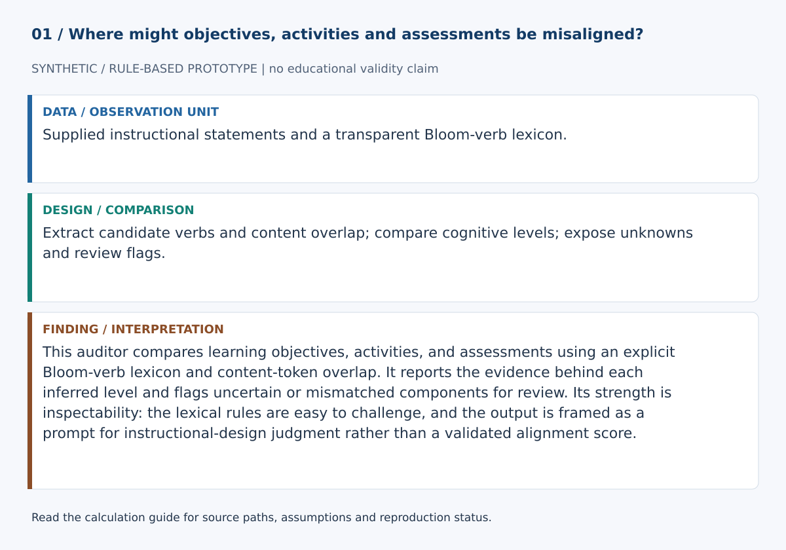
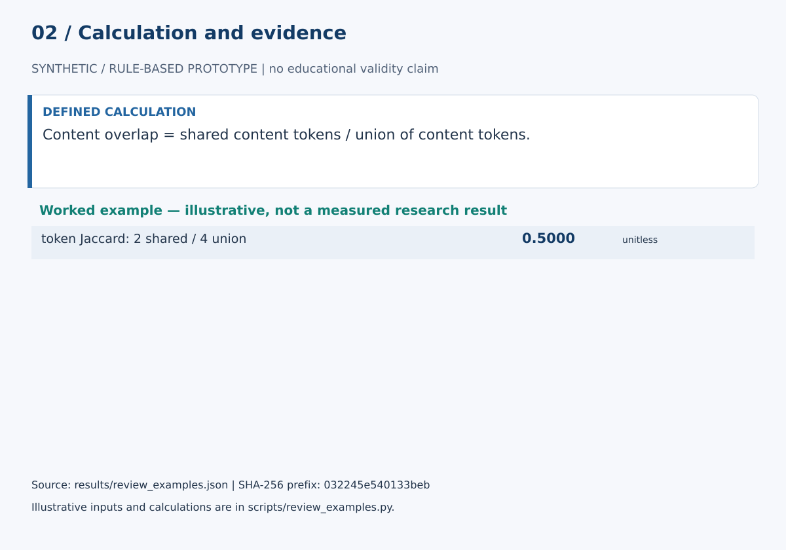

# Constructive Alignment Auditor

This auditor compares learning objectives, activities, and assessments using an explicit Bloom-verb lexicon and content-token overlap. It reports the evidence behind each inferred level and flags uncertain or mismatched components for review. Its strength is inspectability: the lexical rules are easy to challenge, and the output is framed as a prompt for instructional-design judgment rather than a validated alignment score.

## Start here

- [Calculations, evidence and verification scope](CALCULATIONS.md)
- [Figure sources and exact numerical paths](docs/figure_spec.json)
- [Data status](data/README.md)





**Review scope:** 15 existing unittest checks passed. The bundled demonstration executed successfully in this review.

## Detailed project documentation

> Transparent rule-based signals for reviewing cognitive demand and lexical relationships across outcomes, learning activities, and assessments.

[](https://github.com/devissaputra/constructive_alignment_auditor/actions/workflows/ci.yml)


**Area:** AI in Education (AIEd) · Instructional Design & Curriculum Intelligence  
**Status:** working research prototype  
**Author:** Devis Saputra

## What this project is for

A curriculum can contain individually reasonable outcomes, activities, and assessments while still leaving important relationships unclear. This repository provides a transparent baseline that helps curriculum reviewers inspect those relationships without turning them into one opaque score.

**Who may find it useful:** instructional designers, curriculum teams, learning designers, and education researchers studying constructive alignment.

## Research questions

1. Where do the cognitive demands of outcomes, activities, and assessments differ?
2. Can transparent rule-based signals help experts notice cases worth closer inspection?
3. Where do automated review flags agree or disagree with curriculum reviewers?

## How it works

The auditor keeps three curriculum elements separate:

- intended learning outcome
- teaching or learning activity
- assessment task

For each element, it detects explicit Bloom-style action verbs and reports the highest detected cognitive-process level. It then compares activity and assessment levels with the outcome, calculates lexical overlap, and generates transparent review flags.


The tool does **not** automatically declare a course aligned or misaligned. A difference such as `assessment_above_outcome` is a prompt for expert review because the difference may be intentional and pedagogically appropriate.


The bundled example is synthetic. It demonstrates the software path and should not be interpreted as an empirical finding.

## Current baseline methods

- expanded Bloom-style action-verb lexicon
- lightweight matching for common verb inflections
- highest detected cognitive-process level
- explicit activity and assessment level gaps
- relation labels: `same_level`, `below_outcome`, `above_outcome`, `unknown`
- stopword-filtered Jaccard content-word overlap
- transparent review flags
- plain-language review summary

The baseline intentionally avoids a single overall "alignment score."

## Example

The bundled example compares:

- **Outcome:** Analyze system tradeoffs
- **Activity:** Compare system architectures and tradeoffs
- **Assessment:** Justify the selected system architecture

The rule baseline detects:

- outcome: `analyze`
- activity: `analyze`
- assessment: `evaluate`
- activity gap: `0`
- assessment gap: `+1`
- review flag: `assessment_above_outcome`

That flag means **review the difference**, not "the assessment is wrong."

## Data

`data/sample.csv` contains only a synthetic curriculum example. It contains no learner records.

`data/README.md` documents the current schema and a more rigorous structure for future expert-labelled evaluation data.

## Run the demo

```bash
git clone https://github.com/devissaputra/constructive_alignment_auditor.git
cd constructive_alignment_auditor
python scripts/run_demo.py
python -m unittest discover -s tests -v
```

## Core API

`bloom_evidence(text)` exposes the actual detected action verbs by level.

`bloom_level(text)` returns the highest detected Bloom-style level or `unknown`.

`token_overlap(left, right)` computes Jaccard overlap over lightly normalized content words after stopword removal.

`compare_levels(outcome_level, other_level)` reports an ordinal gap and a transparent relation label.

`audit(outcome, activity, assessment)` returns the complete review record: detected levels, evidence verbs, level gaps, relation labels, overlap values, review flags, and review summary.

## Evaluation view


The dashboard shows the evidence categories a real validation study should inspect. The bars are illustrative only and do not report measured performance.

## Limits and responsible use

Bloom-style action verbs are heuristics. They do not fully represent task complexity, disciplinary practice, authenticity, rubric quality, scaffolding, or what students actually do.

Lexical overlap measures wording similarity, not conceptual equivalence.

The system is therefore a **review aid**, not an accreditation, programme-quality, compliance, or instructor-performance judge.

See `docs/ethics_and_risks.md` for the broader risk review.

## Repository map

```text
.
├── .github/workflows/ci.yml
├── assets/
│   ├── architecture.svg
│   ├── data_flow.svg
│   ├── demo_snapshot.svg
│   └── evaluation_dashboard.svg
├── data/
│   ├── README.md
│   └── sample.csv
├── docs/
│   ├── ethics_and_risks.md
│   ├── related_work.md
│   └── research_protocol.md
├── reports/model_card.md
├── scripts/run_demo.py
├── src/constructive_alignment_auditor/core.py
├── tests/test_core.py
├── .gitignore
├── CITATION.cff
├── LICENSE
├── pyproject.toml
└── README.md
```

## Research path

A credible next version would:

1. build an expert-labelled dataset spanning several disciplines
2. measure reviewer agreement before using expert labels as a reference
3. quantify rule-baseline error patterns and unknown-verb rates
4. compare the transparent lexical baseline with semantic text representations
5. study disagreement cases rather than reporting only an average accuracy score
6. test whether the tool improves the quality or efficiency of human curriculum review

## Related work

`docs/related_work.md` explains the constructive-alignment and Bloom-taxonomy context used by this baseline. The repository does not claim that its verb rules constitute a validated constructive-alignment instrument.

## Citation and license

`CITATION.cff` contains the software citation. Code and original SVG visuals use the MIT License. External datasets and curriculum documents retain their own licenses and usage conditions.
